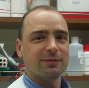
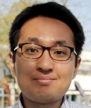

### Professional Profile

**Alexander Eckehart Urban** (Stanford University)

- Associate Professor, Psychiatry and Behavioral Sciences 
- Associate Professor, Genetics
- Ph.D., Molecular, Cellular and Developmental Biology, Yale University

### Keynote 
- Thursday, 24 April 2025, 09:30-10:30 (60 min)

### Abstract
- Title : Advanced experimental and computational genome analysis approaches to resolve complex genome variation associated with the human brain

The human genome sequence contains complexities in many different manifestations. Often these complexities are associated with, or at least implicated to play a role in, normal and abnormal development and functioning of the human brain. Standard genome sequencing may not be well suited to resolve these types of genome sequence complexities. But advanced approaches for genome sequence analysis, on the experimental and computational level, can be used to reveal complex genome sequence variation that is associated with the human brain.

Several types of complex genome sequence variation, and the approaches used to analyze them, will be discussed. Even standard short-read whole-genome sequencing data can be computationally processed using graph-based analysis and machine learning filters to reveal structural sequence variation in the unique sequence portion of the genome, including complex structural variants (cxSVs). Meanwhile, segmental duplication (SegDup) portions of the human genome are mostly impenetrable to short-read sequencing but can be resolved, in psychiatric patient cohorts, using in vitro CRISPR-targeting combined with long-read sequencing and de novo assembly. Further, an additional layer of genome sequence complexity can exist by having sequence variation present not in the germline but in somatic tissues. Ultra-deep sequencing again coupled with machine learning filters, can be employed to detect and analyze such somatic variation, for example somatic insertions of LINE-1 retrotransposons in human brain cells.

---

### Professional Profile

**Choongwon Jeong** (Seoul National University)

- Associate Professor, School of Biological Sciences
- Ph.D., Human Genetics, University of Chicago

### Keynote
- Friday, 25 April 2025, 09:30-10:30 (60 min)

### Abstract
- Abstract title : Recombination between chromosomes from divergent lineages harbors key information to reconstruct evolutionary history

When populations meet and mix after a long separation, recombination produces stitched chromosomes from segments of different ancestral origins over generations. The ancestral origin of a chromosomal segment, i.e. local ancestry, can greatly help reconstruct the genetic history of a population although it is not directly observable. Also, the number, length, and the genomic distribution of ancestral segments provide fine-resolution information on the history and adaptation of the admixed population. In this talk, we present two case studies in which the admixture of divergent lineages is a key evolutionary process. First, we present 166 ancient cattle genomes from northern China, dated to 10,000-200 years before present (yBP). We show that the local wild aurochs contributed to ~12% of the ancestry of the earliest taurine cattle in East Asia and the aurochs legacy is still present in modern cattle such as Hanwoo. A severe depletion of introgressed segments on the X chromosome suggests a male-driven introgression as well as a role of natural selection. Second, we present a genomic history of a recently invading swarming fly, Plecia longiforceps, based on 150 genomes across its range. We confirm a northern Chinese origin of the Korean population, a long and complex history of its northward expansion involving admixture, and clear signatures of local adaptation to northern environments. Together, these studies highlight a critical role of admixture in shaping a species’ evolutionary history.

---

### Professional Profile

**Eun-Kyeong Jo** (Chungnam National University)

- Professor, Dept. of Microbiology, College of Medicine
- Ph.D., Microbiology, Chungnam National University

### Keynote
- Friday, 25 April 2025, 13:30-14:20 (50 min)

### Abstract
- Abstract title : When infection biology meets bioinformatics

As an infection biologist, I have had a long-standing interest in host-pathogen interactions during mycobacterial infections, particularly those caused by Mycobacterium tuberculosis (Mtb) and non-tuberculous mycobacteria (NTM). In the post-COVID-19 era, both Mtb-induced tuberculosis and NTM infections continue to pose significant clinical challenges, especially due to the growing resistance of these pathogens to conventional antibiotics—highlighting critical unmet medical needs. Given that autophagy is a vital cellular process responsible for lysosomal degradation and innate immune defense against intracellular bacterial infections, our long-term research has focused on understanding how to harness autophagy as a new host-directed therapeutic strategy to combat mycobacterial infections. In this talk, I will share our research journey exploring the role of autophagy in mycobacterial infection, with a particular emphasis on comparative genetics using alternative host infection models. Additionally, I will present our recent findings on host defense mechanisms against NTM infection, achieved through multidisciplinary collaborative approaches combining transcriptomics, microbiome studies, and metagenomic analysis. Despite the massive amounts of biological data generated in infection biology, efficiently analyzing, interpreting, and translating these datasets into actionable insights for therapeutic development remains a significant challenge. Moreover, bioinformatics predictions and findings must be validated biologically to ensure their relevance and impact. Moving forward, integrating biology and bioinformatics through close collaboration between wet-lab experiments and computational studies will be essential for advancing novel therapeutic strategies against infectious diseases.

